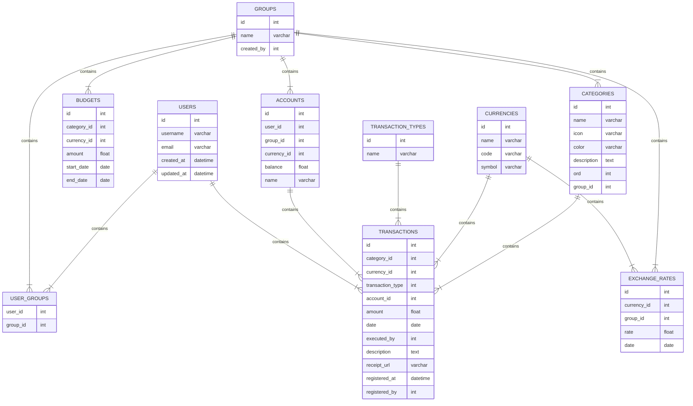

# ER Diagram

```mermaid

erDiagram
    USERS {
        id int
        username varchar
        email varchar
        created_at datetime
        updated_at datetime
    }

    GROUPS {
        id int
        name varchar
        created_by int
    }

    BUDGETS {
        id int
        category_id int
        currency_id int
        amount float
        start_date date
        end_date date
    }

    USER_GROUPS {
        user_id int
        group_id int
    }

    CATEGORIES {
        id int
        name varchar
        icon varchar
        color varchar
        description text
        ord int
        group_id int
    }

    CURRENCIES {
        id int
        name varchar
        code varchar
        symbol varchar
    }

    EXCHANGE_RATES {
        id int
        currency_id int
        group_id int
        rate float
        date date
    }

    TRANSACTIONS {
        id int
        category_id int
        currency_id int
        transaction_type int
        account_id int
        amount float
        date date
        executed_by int
        description text
        receipt_url varchar
        registered_at datetime
        registered_by int
    }

    TRANSACTION_TYPES {
        id int
        name varchar
    }

    ACCOUNTS {
        id int
        user_id int
        group_id int
        currency_id int
        balance float
        name varchar
    }

    USERS ||--|{ USER_GROUPS : contains
    GROUPS ||--|{ USER_GROUPS : contains
    GROUPS ||--|{ ACCOUNTS : contains
    GROUPS ||--|{ EXCHANGE_RATES : contains    
    GROUPS ||--|{ CATEGORIES : contains
    GROUPS ||--|{ BUDGETS : contains
    CATEGORIES ||--|{ TRANSACTIONS : contains
    CURRENCIES ||--|{ TRANSACTIONS : contains
    CURRENCIES ||--|{ EXCHANGE_RATES : contains
    TRANSACTION_TYPES ||--|{ TRANSACTIONS : contains
    ACCOUNTS ||--|{ TRANSACTIONS : contains
    USERS ||--|{ TRANSACTIONS : contains

```
