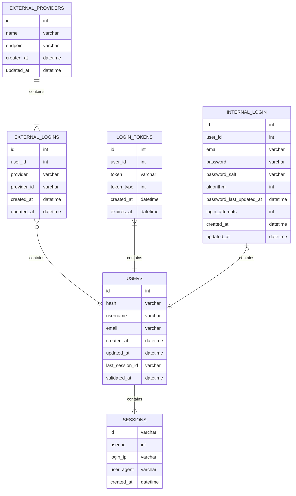
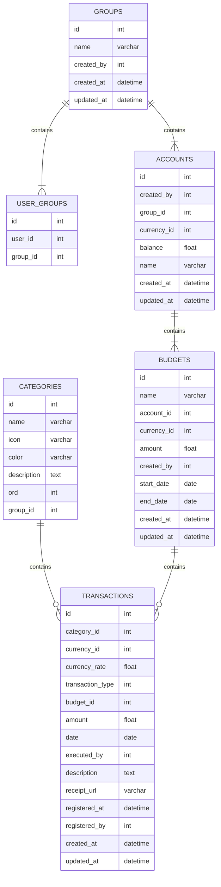
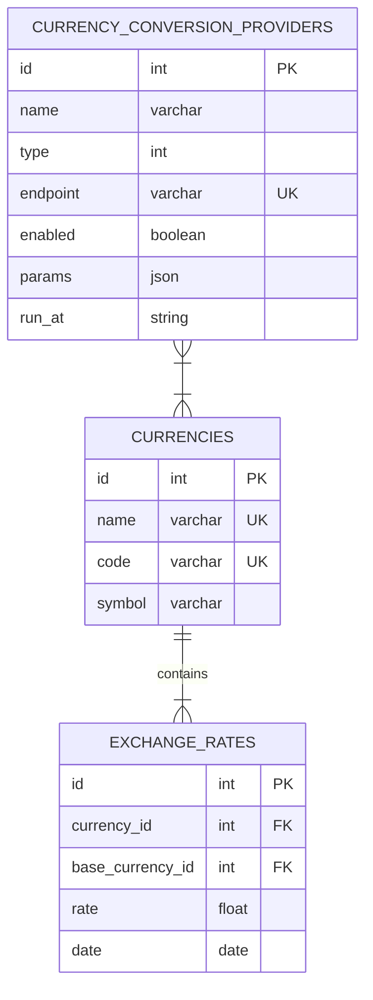
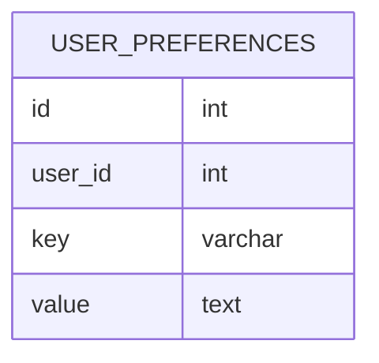
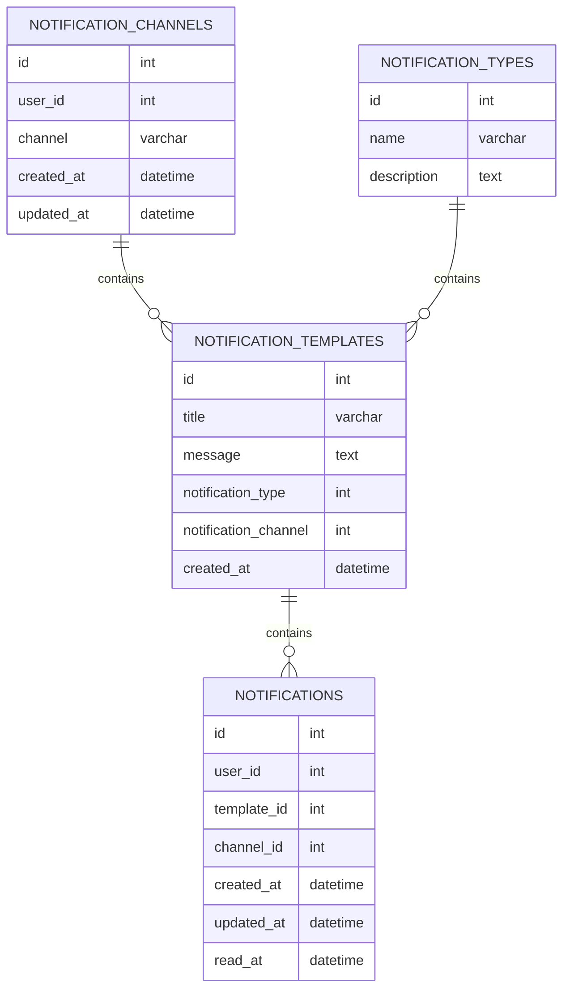

# ER Diagrams

Here are the ER diagrams for the database schema.

## User Auth

```mermaid

erDiagram
    USERS {
        id int
        hash varchar
        username varchar
        email varchar
        created_at datetime
        updated_at datetime
        last_session_id varchar
        validated_at datetime
    }

    INTERNAL_LOGIN {
        id int
        user_id int
        email varchar
        password varchar
        password_salt varchar
        algorithm int
        password_last_updated_at datetime
        login_attempts int
        created_at datetime
        updated_at datetime
    }

    LOGIN_TOKENS {
        id int
        user_id int
        token varchar
        token_type int
        created_at datetime
        expires_at datetime
    }

    EXTERNAL_LOGINS {
        id int
        user_id int
        provider varchar
        provider_id varchar
        created_at datetime
        updated_at datetime
    }

    EXTERNAL_PROVIDERS {
        id int
        name varchar
        endpoint varchar
        created_at datetime
        updated_at datetime
    }

    SESSIONS {
        id varchar
        user_id int
        login_ip varchar
        user_agent varchar
        created_at datetime
    }

    EXTERNAL_PROVIDERS ||--|{ EXTERNAL_LOGINS : contains
    EXTERNAL_LOGINS }o--|| USERS : contains
    LOGIN_TOKENS }|--|| USERS : contains
    INTERNAL_LOGIN |o--|| USERS : contains
    USERS ||--|{ SESSIONS : contains

```

## Core Entities

```mermaid

erDiagram
    GROUPS {
        id int
        name varchar
        created_by int
        created_at datetime
        updated_at datetime
    }

    USER_GROUPS {
        id int
        user_id int
        group_id int
    }

    ACCOUNTS {
        id int
        created_by int
        group_id int
        currency_id int
        balance float
        name varchar
        created_at datetime
        updated_at datetime
    }

    BUDGETS {
        id int
        name varchar
        account_id int
        currency_id int
        amount float
        created_by int
        start_date date
        end_date date
        created_at datetime
        updated_at datetime
    }

    CATEGORIES {
        id int
        name varchar
        icon varchar
        color varchar
        description text
        ord int
        group_id int
    }

    TRANSACTIONS {
        id int
        category_id int
        currency_id int
        currency_rate float
        transaction_type int
        budget_id int
        amount float
        date date
        executed_by int
        description text
        receipt_url varchar
        registered_at datetime
        registered_by int
        created_at datetime
        updated_at datetime
    }

    GROUPS ||--|{ USER_GROUPS : contains
    GROUPS ||--|{ ACCOUNTS : contains
    ACCOUNTS ||--|{ BUDGETS : contains
    CATEGORIES ||--o{ TRANSACTIONS : contains
    BUDGETS ||--o{ TRANSACTIONS : contains

```

## Currency Conversion

```mermaid

erDiagram
    CURRENCIES {
        id int PK
        name varchar UK
        code varchar UK
        symbol varchar
    }

    EXCHANGE_RATES {
        id int PK
        currency_id int FK 
        base_currency_id int FK
        rate float
        date date
    }

    CURRENCY_CONVERSION_PROVIDERS {
        id int PK
        name varchar
        type int
        endpoint varchar UK
        enabled boolean
        params json
        run_at string
    }

    CURRENCIES ||--|{ EXCHANGE_RATES : contains
    CURRENCY_CONVERSION_PROVIDERS }|--|{ CURRENCIES : ""

```

## User Preferences

```mermaid

erDiagram
    USER_PREFERENCES {
        id int
        user_id int
        key varchar
        value text
    }

```

## Notifications

```mermaid

erDiagram

    NOTIFICATION_TEMPLATES {
        id int
        title varchar
        message text
        notification_type int
        notification_channel int
        created_at datetime
    }

    NOTIFICATION_TYPES {
        id int
        name varchar
        description text
    }

    NOTIFICATION_CHANNELS {
        id int
        user_id int
        channel varchar
        created_at datetime
        updated_at datetime
    }

    NOTIFICATIONS {
        id int
        user_id int
        template_id int
        channel_id int
        created_at datetime
        updated_at datetime
        read_at datetime
    }

    NOTIFICATION_CHANNELS ||--o{ NOTIFICATION_TEMPLATES : contains
    NOTIFICATION_TYPES ||--o{ NOTIFICATION_TEMPLATES : contains
    NOTIFICATION_TEMPLATES ||--o{ NOTIFICATIONS : contains

    
```
